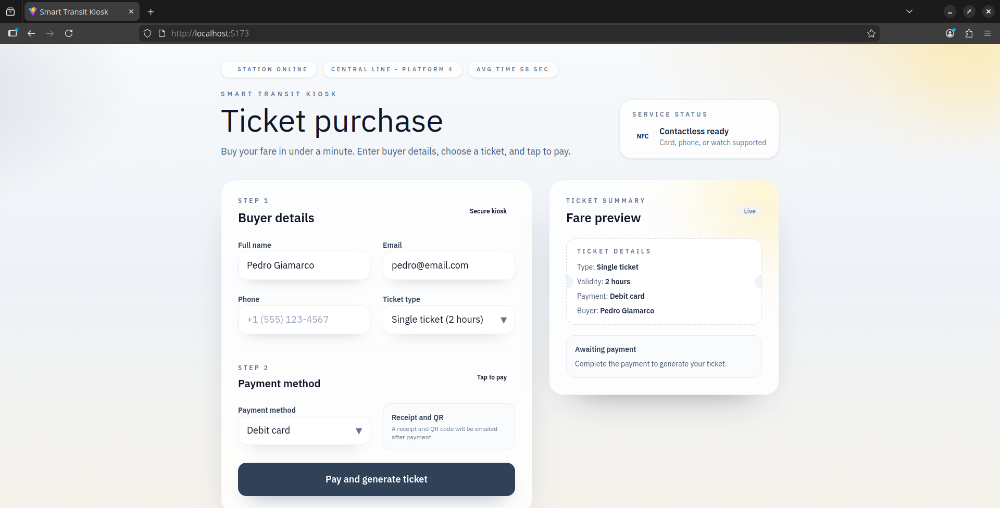
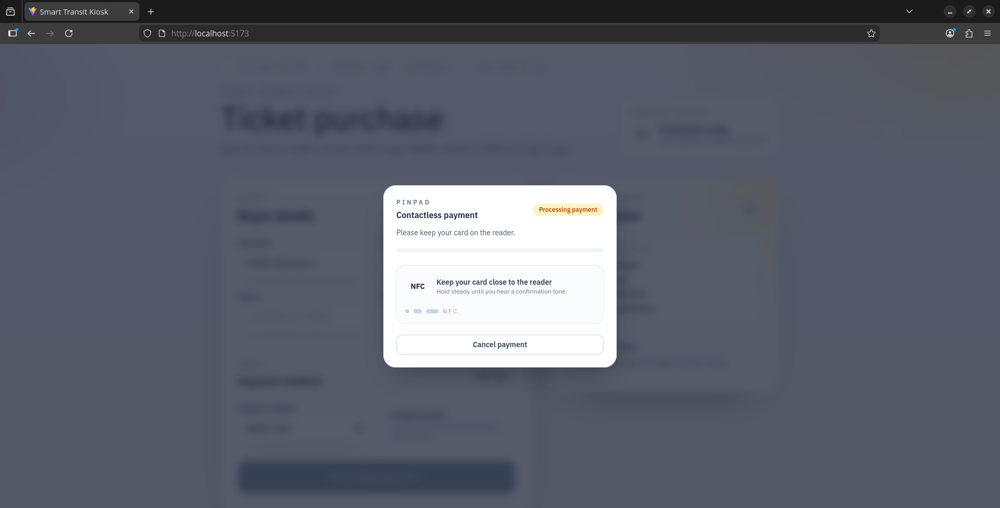
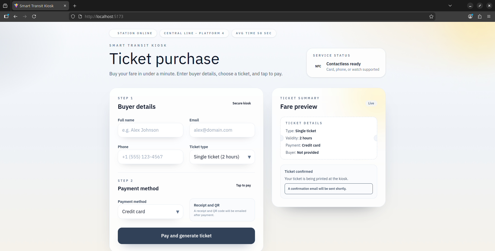
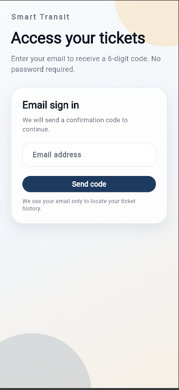
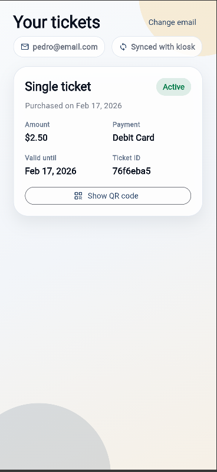
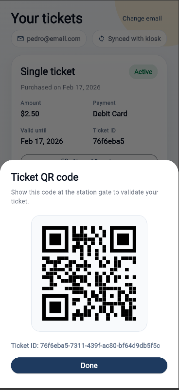

# Smart Transit Kiosk

Smart Transit Kiosk is a full-stack project for purchasing, validating, and managing train tickets. It includes a backend API, a web kiosk frontend, and a mobile app for ticket access and QR code retrieval.

## Components

- `backend` - Node.js + Express + Prisma API with PostgreSQL
- `frontend` - Web kiosk UI built with React + Tailwind
- `mobile` - Flutter app with email login and ticket history

## Requirements

- Node.js 18+
- Docker (optional, recommended for backend)
- Flutter SDK 3.10+

## Quick Start

### Backend

1. `cd backend`
2. `cp .env.example .env` and fill database settings
3. `npm install`
4. `npm run generate`
5. `npm run migrate`
6. `npm run dev`

API defaults to `http://localhost:3333`.

### Web Frontend

1. `cd frontend`
2. `npm install`
3. `npm run dev`

Frontend defaults to `http://localhost:5173`.

### Mobile

1. `cd mobile`
2. `flutter pub get`
3. `flutter run`

By default, the mobile app calls the backend at `http://10.0.2.2:3333` (Android emulator). Update the base URL in `mobile/lib/repository/ticket_repository.dart` if needed.

## Backend API (Key Endpoints)

- `GET /health`
- `POST /api/tickets`
- `GET /api/tickets/:id`
- `POST /api/purchases`
- `GET /api/purchases/:id`
- `GET /api/purchases?email=user@example.com`

## Notes

- Mobile login is currently mocked in `mobile/lib/repository/login_repository.dart` and should be replaced with real auth endpoints.
- Ticket QR codes are generated server-side and displayed in the mobile app.

## Screenshots (Flow)

### Web Kiosk

1. Generate ticket form  
   
2. Payment flow  
   
3. Confirmation after payment  
   

### Mobile App

1. Login screen  
   
2. Email confirmation code  
   
3. Ticket list (home)  
   
4. Ticket QR code  
   

## Folder Structure

- `backend/` - API server
- `frontend/` - Web kiosk UI
- `mobile/` - Flutter app

## License

ISC (see `backend/README.md` for details).
